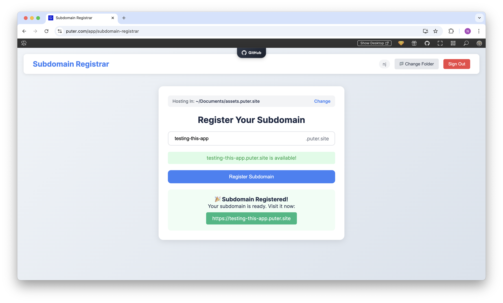

<h1 align="center">
  <a href="https://puter.com/app/subdomain-registrar" target="_blank">Subdomain Registrar</a>
</h1>

<p align="center">A web application for registering and managing subdomains on puter.site with real-time availability checking.
</p>

<p align="center">
  
</p>

<br>

## Features

- **User Authentication**: Secure sign-in with Puter account
- **Subdomain Availability**: Real-time availability checking
- **Folder Selection**: Custom directory selection for subdomain files
- **Instant Deployment**: Zero-configuration publishing to puter.site
- **Domain Management**: Tools for managing existing subdomains

<br>

## Getting Started

Clone the repository: 

```bash
git clone https://github.com/puter-apps/subdomain.git
```

and open the `index.html` file in any hosted environment.

Alternatively, access the hosted version at [puter.com/app/subdomain-registrar](https://puter.com/app/subdomain-registrar).

<br>

## How It Works

Subdomain Registrar leverages [**Puter.js**](https://developer.puter.com/) to simplify domain registration:

1. **Authentication**: Uses Puter's authentication system to verify user identity

2. **Domain Verification**: Checks domain availability against Puter's registry in real-time

3. **File System Integration**: Connects selected directories to the registered subdomain

4. **Hosting Configuration**: Automatically configures hosting for the new subdomain

<br>

## License

MIT
